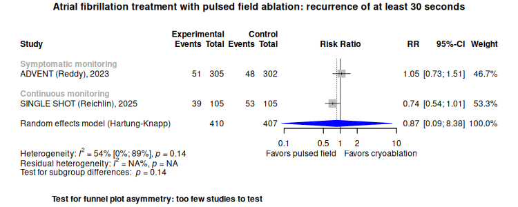

Atrial fibrillation treatment with pulsed field ablation
============================================
A living systematic review

Short url: http://openMetaAnalysis.github.io/afib-rx-pulsed-field

**Clinical summary:** 
This meta-analysis compares pulsed field ablation to thermal ablation. This meta-analysis suggests that the effectiveness of the clinical intervention *depends* on how the outcome of recurrent atrial fibrilation is monitoried. Regarding atrial fibrillation of at least 30 seconds lasting at least 30 seconds during days post-procedure 91 to 365, the SINGLE SHOT trial reported a borderling p-value of 0.046 with continous monitoring. However, the ADVENT trial did not use continuous monitoring and was insignificant. In addition, the forest plot below does not quite statistical benefit in the SINGLE SHOT trial for the recurrent atrial fibrillation.
Heterogeneity of results as measured by I2 '[moderate]([https://training.cochrane.org/handbook/current/chapter-10#section-10-10-2](https://handbook-5-1.cochrane.org/chapter_9/9_5_2_identifying_and_measuring_heterogeneity.htm))' to 'substantial' at 54% for all analyses; however very wide confidence intervals reflect the small number of studies and subjects. 

<!--
Meta-regression of common modulators (year of publication, study size, event rate in the control groups) has not been done due to the small number of studies.
-->

This review updates previously published meta-analysis(es).(citation[s] below)

* [Reconciliation of studies and conclusions with prior meta-analyses](files/reconciliation-tables/Reconciliation%20of%20studies%20and%20conclusions.pdf)
* [Keep current with this topic](files/searching/Keep-up.md)

Acknowledgement: we acknowledge the essential work by the authors of the prior [systematic review(s)](#systematic-reviews) listed below.

**Methods overview:** This repository is an [openMetaAnalysis](https://openmetaanalysis.github.io/) that combines methods of scoping, rapid, and living systematic reviews.  This analysis updates one or more previously published review(s) below. A comparison of studies included in this review compared to prior reviews are in the table, [reconciliation of trials included with prior meta-analyses/](files/reconciliation-tables/Reconciliation%20of%20studies.pdf). Newer studies included are listed in the references below. Rationale for newer trials excluded may be listed at the end of the references. 
* [Methods](http://openmetaanalysis.github.io/methods.html) for openMetaAnalysis
* [Evidence search](files/searching/evidence-search.md) for this review (under construction)

**Results:** Details of the studies included are in the:
* [Reconciliation of studies and conclusions with prior meta-analyses](files/reconciliation-tables/Reconciliation%20of%20studies%20and%20conclusions.pdf) (under construction)
* [Description of studies (PICO table)](files/study-details/table-pico.pdf) (under construction)
* [Risk of bias assessment](files/study-details/table-bias.pdf) (under construction)
* [Forest plots](../master/files/forest-plots) ([spreadsheets with source data](files/data))
* [Network plots](../master/files/network) (optional)

The forest plot for the primary outcomes are below. Additional [forest plots](files/forest-plots) of secondary analyses may be available. 

<!--
The meta-regression for the primary outcomes are below. Additional [meta-regressions](files/metaregression) of secondary analyses may be available. 

The GRADE Profile is below. 
-->
References:
----------------------------------

### Systematic review(s)
#### Most recent review at time of last revision of this repository
1.  Montané B, Zhang S, Wolfe JD, Prime S, Luo C, Cooper DH, Doering M, Blomstrom-Lundqvist C, Nashef SAM, Osmancik P, Andrade JG, Bertaglia E, Parkash R, Mark DB, Nielsen JC, Sharples LD, Gage BF. Catheter and Surgical Ablation for Atrial Fibrillation. Ann Intern Med [Internet]. American College of Physicians; 2025 Jul [cited 2025 Jul 1]; Available from: https://www.acpjournals.org/doi/10.7326/ANNALS-25-00253 *This review did not addrssed pulsed-field treatment.*

### Randomized controlled trials
#### New trial(s) *not* included in the most recent review above
1. Reichlin T, Kueffer T, Badertscher P, Jüni P, Knecht S, Thalmann G, Kozhuharov N, Krisai P, Jufer C, Maurhofer J, Heg D, Pereira TV, Mahfoud F, Servatius H, Tanner H, Kühne M, Roten L, Sticherling C; SINGLE SHOT CHAMPION Investigators. Pulsed Field or Cryoballoon Ablation for Paroxysmal Atrial Fibrillation. N Engl J Med. 2025 Apr 17;392(15):1497-1507. doi: [10.1056/NEJMoa2502280](https://doi.org/10.1056/NEJMoa2502280). Epub 2025 Mar 31. PMID: [40162734](https://pubmed.gov/40162734).
2. Reddy VY, Gerstenfeld EP, Natale A, Whang W, Cuoco FA, Patel C, Mountantonakis SE, Gibson DN, Harding JD, Ellis CR, Ellenbogen KA, DeLurgio DB, Osorio J, Achyutha AB, Schneider CW, Mugglin AS, Albrecht EM, Stein KM, Lehmann JW, Mansour M; ADVENT Investigators. Pulsed Field or Conventional Thermal Ablation for Paroxysmal Atrial Fibrillation. N Engl J Med. 2023 Nov 2;389(18):1660-1671. doi: [10.1056/NEJMoa2307291](https://doi.org/10.1056/NEJMoa2307291). Epub 2023 Aug 27. PMID: [37634148](https://pubmed.gov/37634148).

#### Trial(s) included in the review above
NA

#### Trial(s) undergoing review
None

#### Trial(s) excluded - selected list of important trial(s)
1. Verma A, Haines DE, Boersma LV, Sood N, Natale A, Marchlinski FE, Calkins H, Sanders P, Packer DL, Kuck KH, Hindricks G, Onal B, Cerkvenik J, Tada H, DeLurgio DB; PULSED AF Investigators. Pulsed Field Ablation for the Treatment of Atrial Fibrillation: PULSED AF Pivotal Trial. Circulation. 2023 May 9;147(19):1422-1432. doi: [10.1161/CIRCULATIONAHA.123.063988](https://doi.org/10.1161/CIRCULATIONAHA.123.063988). Epub 2023 Mar 6. PMID: [36877118](https://pubmed.gov/36877118); PMCID: [PMC10158608](https://www.ncbi.nlm.nih.gov/pmc/articles/PMC10158608). *Exluded as was a single-arm study*

#### Cited by
This repository is cited by:

1. WikiDoc contributors. Pending content page. WikiDoc. Nov 9, 2014. Available at: http://www.wikidoc.org/index.php/This_topic. Accessed November 9, 2014. 

-------------------------------
[Cite and use this content](https://github.com/openMetaAnalysis/openMetaAnalysis.github.io/blob/master/reusing.MD)  - [Edit this page](../../edit/master/README.md) - [License](files/LICENSE.md) - [History](../../commits/master/README.md)  - 
[Issues and comments](../../issues?q=is%3Aboth+is%3Aissue)

